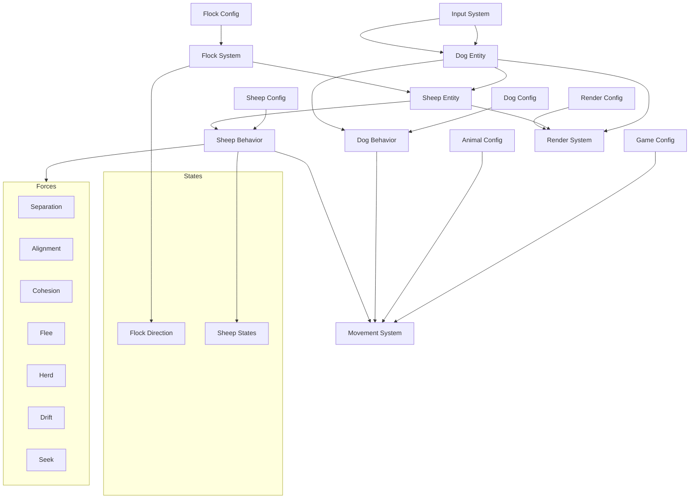

# Sheep Simulation - Project Architecture

This document outlines the high-level architecture of the sheep herding simulation project, explaining how the various components interact to create a realistic flocking and herding system.

## Project Overview

The project is a 2D simulation of sheep flocking behavior and dog herding mechanics, built using the LÖVE 2D game framework (Lua). It demonstrates emergent behaviors through a force-based movement system with realistic animal interactions.

## Core Architectural Components

The architecture follows a structured design with clear separation of concerns:

### 1. Entity Components

Entities represent the physical objects in the simulation:

- **Sheep**: Individual animals that exhibit flocking behavior
- **Dog**: The herding actor controlled by user input

### 2. Behavior Systems

Specialized behavior systems handle different aspects of the simulation:

- **Sheep Behavior**: Controls sheep states, interactions, and responses
- **Dog Behavior**: Controls how the dog moves and influences sheep
- **Movement**: Shared physics of motion (velocity, drag, collisions)
- **Flock**: Manages the entire sheep flock as a coordinated unit

### 3. Support Systems

Additional systems that handle simulation mechanics:

- **Input**: Processes user input to control the dog
- **Render**: Handles drawing entities to the screen

### 4. Configuration

Separated configuration files for parameters:

- **Sheep Config**: Parameters for sheep behavior
- **Dog Config**: Parameters for dog movement and influence
- **Flock Config**: Parameters for flock-wide behavior
- **Animal Config**: Shared parameters for animal movement
- **Game Config**: Global simulation parameters
- **Render Config**: Visual presentation parameters

## Data Flow

The data flow in the application follows these patterns:

1. **Input Processing**: User input → Input System → Dog Entity
2. **Behavior Calculation**: Entities + Config → Behavior Systems → Force Calculations
3. **Physics Application**: Forces → Movement System → Entity Positions
4. **Rendering**: Entity States → Render System → Screen Display

## Component Relationships

## File Structure

The project organizes files into logical groups:

- `config/`: Configuration parameters for different components
- `entities/`: Entity definitions for simulation objects
- `systems/`: Core simulation systems
  - `systems/behavior/`: Specific behavior implementations
- `libs/`: Utility libraries (like the Vector implementation)
- `main.lua`: Application entry point

## Architectural Patterns

The project demonstrates several architectural patterns:

1. **Entity-Component System**: Entities (sheep, dog) have their behavior handled by separate systems
2. **Configuration Injection**: Behavior parameters are separated into config files
3. **Force-Based Physics**: Movement is calculated through weighted force accumulation
4. **State-Based Behavior**: Entities change behavior based on their current state
5. **Emergent Complexity**: Simple rules at the individual level create complex collective behaviors

## Technical Design Decisions

Several key design decisions shape the architecture:

1. **Separation of Behavior from Entities**: Each entity delegates behavior to specialized systems
2. **Parameterized Configuration**: Easy tuning through separated configuration files
3. **Vector Mathematics**: Consistent use of vector operations for movement calculations
4. **State-Driven Behaviors**: Different behaviors based on contextual states
5. **Global vs. Local Awareness**: Combination of global (flock) and local (individual) decision making
